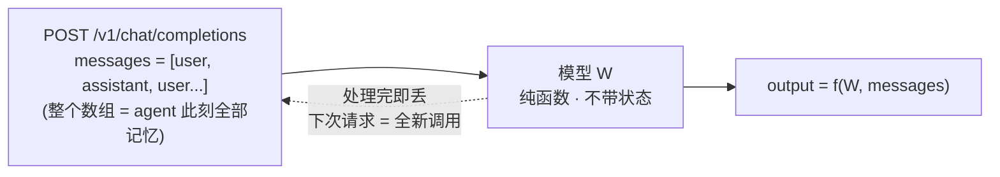
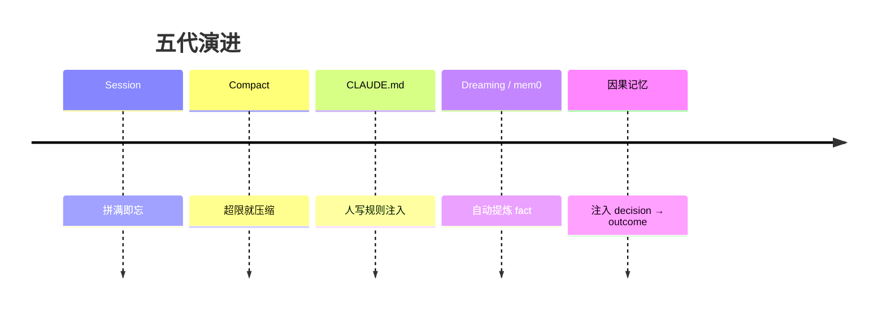
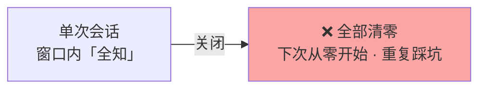
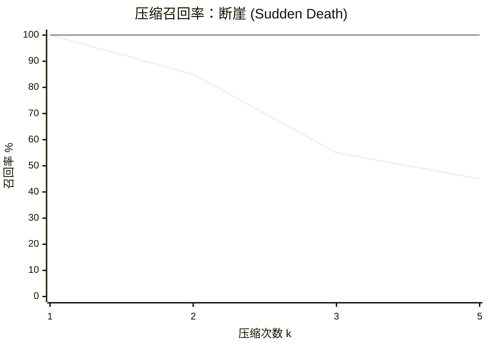
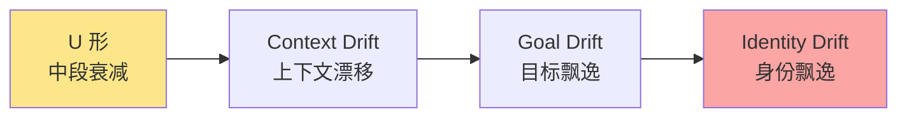
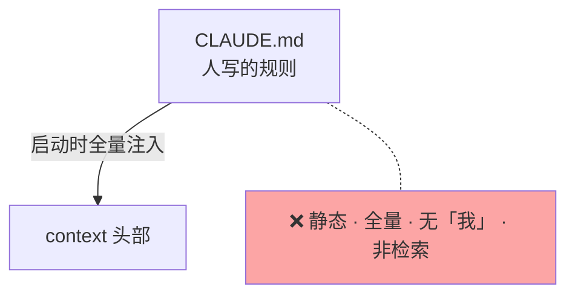
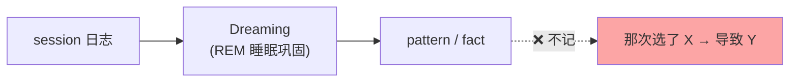
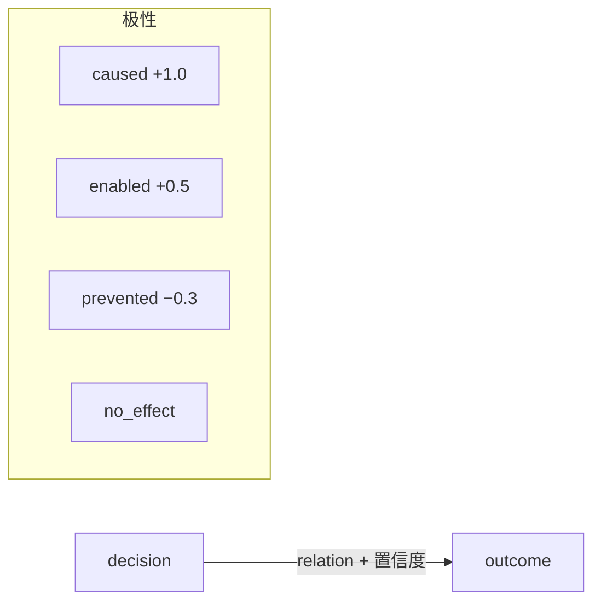
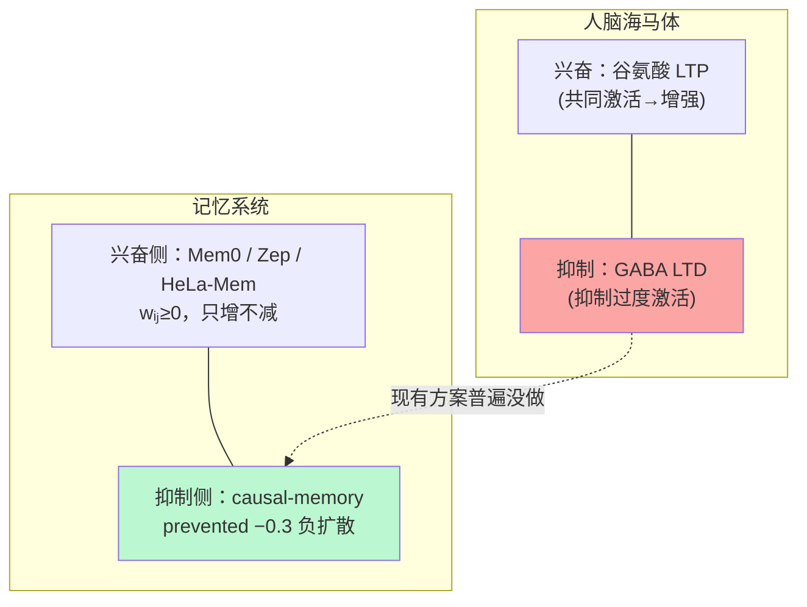

> 一句话：现有记忆系统都只记「是什么」，没人记「做 X 导致了什么」——而经验的核心恰恰是决策的后果。**这是我工作之余的一个探索**：试了几个现成系统都不记因果，顺手做了一个。下面讲清楚为什么需要它、跟现有方案差在哪、效果如何。

---

## 引子：LLM 是无状态纯函数



> **记忆不在模型里，在那个 `messages` 数组里。** 你不塞，它就空——agent 是条 7 秒金鱼。context = 每次要重拼的数组 → 三个问题：**塞什么 / 撑满怎么办 / 塞事实还是因果**。



---

## 1. Session：结束即清零



> 有「工作记忆」，没有「长期记忆」。

---

## 2. Compact：断崖式失忆



| k | 文本召回 | 因果表召回 |
|---|---|---|
| 1 | 100% | 100% |
| 2 | 85% | 100% |
| 3 | 55% | 100% |
| 5 | **45%** | **100%** |

（断崖线=文本召回；平线=因果表召回。因果表独立存储、不进压缩链。）

**三个发现**：① **断崖非渐进**——k=2→3 直接 85%→55%（`0.9^k` 预测 73%，差 18pp）；② **好 prompt 救不了多次压缩**（k=1 顶 100%，之后面对摘要变不回细节）；③ **因果表是第二道防线**——k=2 拉开 15pp，k=5 拉开 55pp。学界印证：*Broken Telephone* (ACL 2025)、rate-distortion (arXiv:2607.08032)。

> 伏笔：因果信息活不过压缩 → 它不该塞进上下文，得有独立存储。

---

## 2.5 飘逸：有 session 也会跑偏

```mermaid
xychart-beta
    title "Lost in the Middle：U 形召回"
    x-axis "信息位置" [头部, 偏前, 中部, 偏后, 尾部]
    y-axis "召回率 %" 40 --> 100
    line [95, 78, 50, 76, 93]
```



「只注意前半段后半段」= U 形盲区（Liu 2023）。它沿链放大成四层飘逸，每层更难救：前三层「记不全」，第四层「记不清自己是谁」。compaction 切断决策因果链 → 身份失真（Parfit：身份=因果连续性）。佐证：Agent-Omit 证中段冗余可省；UltraHorizon 的 in-context locking 证靠 scale 救不回。

---

## 3. CLAUDE.md：说明书，不是履历



> 跨 session 了，但记的是「规则」，不是「**我**踩过这个坑、那次因为 X」。

---

## 4. Dreaming：agent 自己整理，但整理的还是 fact



> 从「人写」进化到「agent 主动巩固」。但颗粒度是 pattern，不是因果。

---

## 5. 现有记忆系统：试了一圈，都不记因果

| 公司 / 项目 | 架构哲学 |
|---|---|
| **Mem0** | 自动抽取 fact + 混合检索 |
| **Zep** | 时序知识图谱 |
| **Letta** | agent 自管理（OS 范式） |
| **OpenViking** | 虚拟文件系统 L0/L1/L2 |
| **MemOS** | 记忆 OS + 跨 LLM 协议 |

> 我挨个试了 mem0 / Zep / Letta，也看了 OpenViking、MemOS——跨美中欧、五种范式，但有个共同点：**都把 LLM 当无状态函数，在外面套「检索+注入」**，没人把记忆写进模型参数。

| 方案 | LongMemEval | 注入 context | 延迟 |
|---|---|---|---|
| Zep | 63.8% | 1.6K | 2.58s |
| Mem0 | 49 → 93.4% | — | — |
| 全塞 | 基准 | 115K | 28.9s |

> 精准检索效果远好于无脑全塞（Zep 用 1/72 的 token 还拿到更高分）。**但全是 fact，回答不了「做 X 会怎样」**——答案不在它们的数据结构里。

---

## 6. 因果记忆：记别人不记的「因果」



**双表（抄大脑 CLS）**：`causal_edges`（海马体，**拒绝压缩**）+ `meta_causal_edges`（新皮层，抽象模式）。

**因果梯级（Pearl）**：

| 层级 | 问题 | 工具 |
|---|---|---|
| L1 关联 | 「有类似情况吗？」 | `search_causal` |
| L2 干预 | 「**做 X 会怎样？**」 | `intervention_query` |
| L3 反事实 | 「没做 X 还会发生吗？」 | `counterfactual_query` |

**兴奋 / 抑制二元性（现有方案的普遍空白）**：



手里的方案 + HeLa-Mem 兴奋侧都覆盖了，抑制侧普遍空着——`prevented` 是我在这方向的一个尝试。滴滴 DMS 也在做记忆自进化，不过它选「策略」，我这个 `sleep` 选「因果边」。

> CausalEval **81%**（其它方案在这类因果任务 = 0）。诚实：纯 fact recall 不如 mem0——因果不取代 fact，填 fact 够不到的那层。

---

## 7. 总结：三级跳

| 阶段 | 记什么 | 跨 session | 记因果 |
|---|---|---|---|
| Session | 当前对话 | ❌ | ❌ |
| Compact | 压缩摘要 | ❌ | ❌（因果先丢） |
| CLAUDE.md | 人写规则 | ✅ | ❌ |
| Dreaming / mem0 | fact / pattern | ✅ | ❌ |
| **因果记忆** | **decision → outcome** | ✅ | ✅ |

> **遗忘 → 记事实 → 理解因果。**
> 让 agent 不仅知道「世界什么样」，还知道「自己的每个决定，把项目推向什么结果」。

---

## 参考

- **飘逸机制**：Lost in the Middle ([arXiv:2307.03172](https://arxiv.org/abs/2307.03172)) · Goal Drift ([arXiv:2505.02709](https://arxiv.org/abs/2505.02709)) · Parfit 1984 *Reasons and Persons*
- **压缩损失**：Broken Telephone (ACL 2025) · rate-distortion ([arXiv:2607.08032](https://arxiv.org/abs/2607.08032))
- **滴滴 ICML 2026**：Agent-Omit ([arXiv:2602.04284](https://arxiv.org/abs/2602.04284)) · DMS ([arXiv:2601.22528](https://arxiv.org/abs/2601.22528)) · UltraHorizon ([arXiv:2509.21766](https://arxiv.org/abs/2509.21766))
- **因果理论**：Pearl 2009 *Causality* · HeLa-Mem (ACL 2026)
- **现有记忆系统**：mem0 / Zep / Letta / OpenViking / MemOS
- **研究素材**：agent-teardown `insights/07,09,10,11,16,17` · `papers/02`
- **本项目**：[causal-memory](https://github.com/JingxuanC/causal-memory) · `docs/research-backdrop.zh.md` · `docs/hippocampus-design.md`
